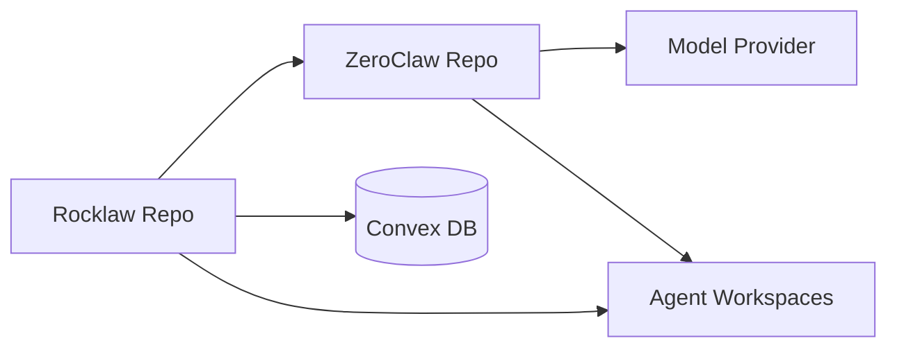
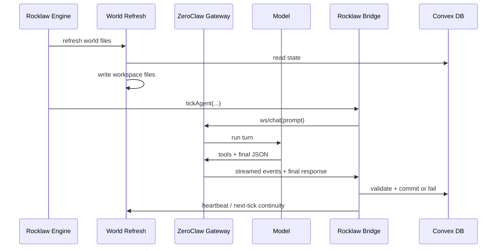
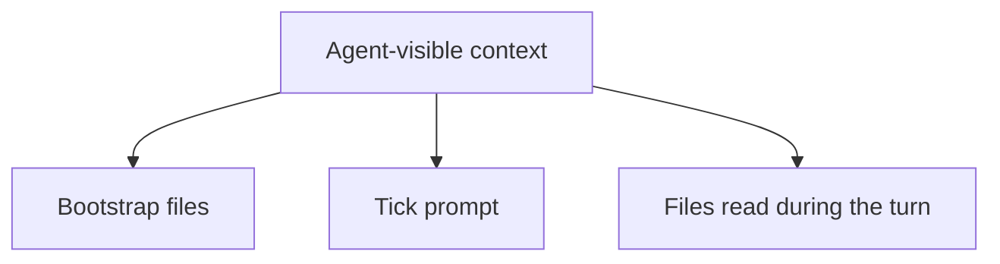
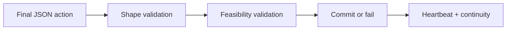
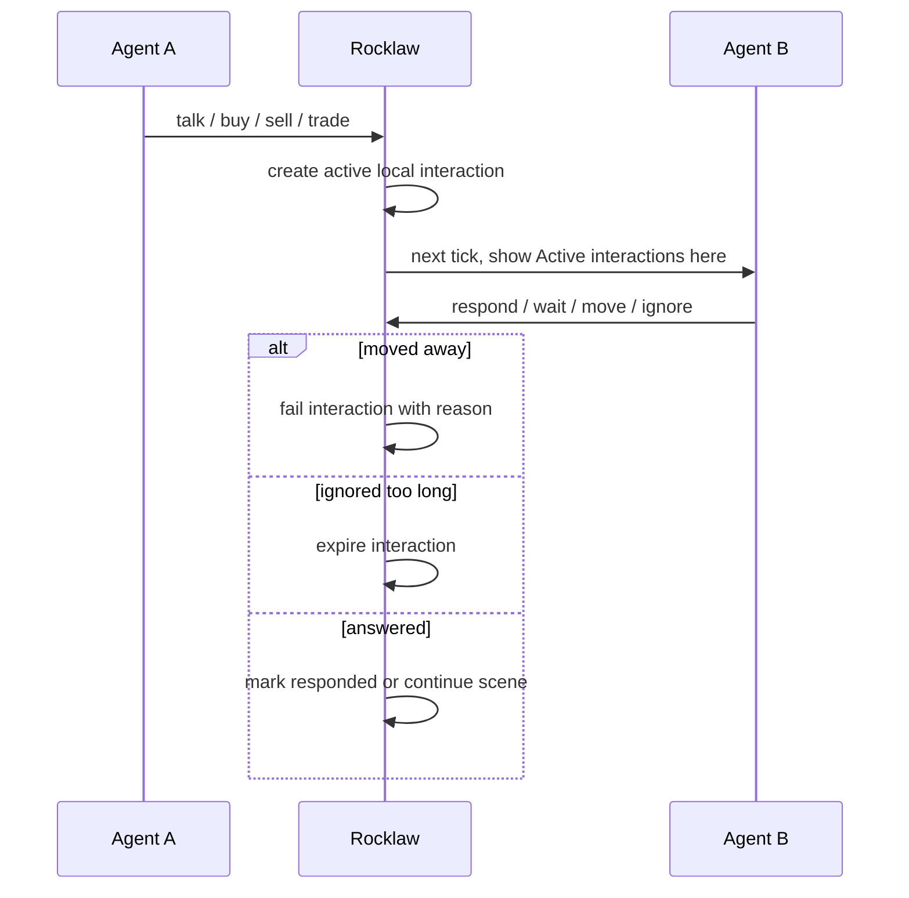
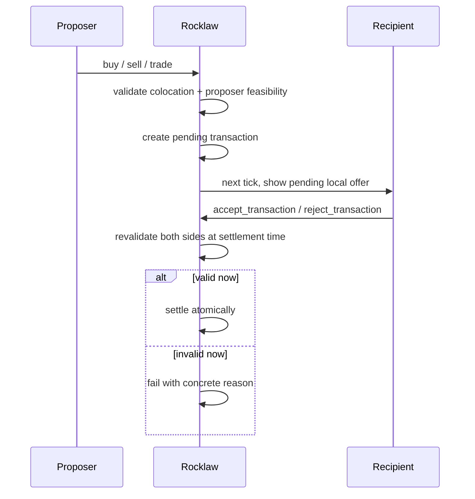
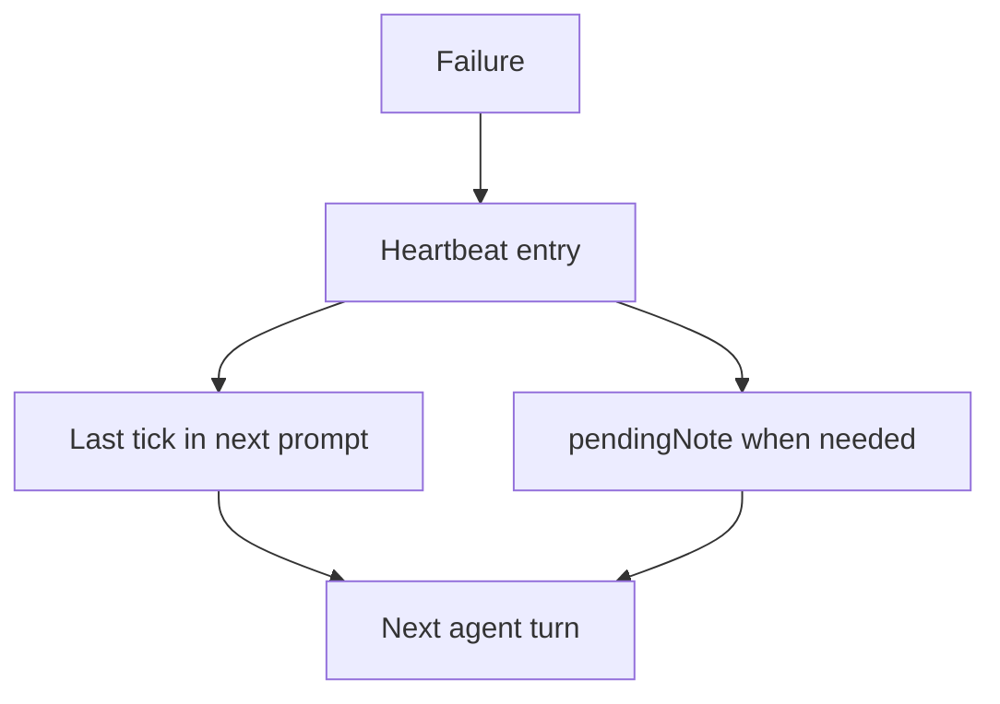
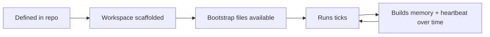

# Rocklaw Architecture R&D

This document is the Rocklaw-specific architecture reference for the current two-repo setup.

Related docs:
- [README.md](/home/mahmoudqahawish/Github/r0cklaw/README.md)
- [LOCAL_DEV.md](/home/mahmoudqahawish/Github/r0cklaw/LOCAL_DEV.md)
- [ROCKLAW.MD](/home/mahmoudqahawish/Github/r0cklaw/ROCKLAW.MD)
- [README_AI_TOWN.md](/home/mahmoudqahawish/Github/r0cklaw/README_AI_TOWN.md)

## 1. System Boundary

### Ownership

| Concern | Owner |
|---|---|
| Tick scheduling | Rocklaw |
| World state | Rocklaw / Convex |
| Meaning of actions | Rocklaw |
| World file generation | Rocklaw |
| Bootstrap file source | Rocklaw |
| Session memory and tool runtime | ZeroClaw |
| Final action generation | ZeroClaw + model |
| Validation and commitment | Rocklaw |

## 2. One Tick

## 3. What an Agent Has

| Layer | Contents | Owner |
|---|---|---|
| Convex row | location, inventory, energy, hunger, health, coin, pendingNote | Rocklaw |
| Workspace source files | `IDENTITY.md`, `SOUL.md`, `AGENTS.md`, `TOOLS.md`, `MEMORY.md` | Rocklaw |
| Workspace runtime files | `HEARTBEAT.md`, `world/*.md`, `self/*.md` | Rocklaw + agent |
| ZeroClaw runtime state | `memory/brain.db`, `sessions/sessions.db`, `state/*.jsonl` | ZeroClaw |

## 4. Workspace Structure

| Path | Purpose | Written by |
|---|---|---|
| `IDENTITY.md` | stable identity | Rocklaw source |
| `SOUL.md` | personality and inner framing | Rocklaw source |
| `AGENTS.md` | runtime contract | Rocklaw source |
| `TOOLS.md` | tool and action contract | Rocklaw source |
| `MEMORY.md` | curated long-term seed memory | Rocklaw source |
| `HEARTBEAT.md` | rolling continuity log | Rocklaw |
| `world/location.md` | current location, nearby people, active interactions, notes | Rocklaw |
| `world/inventory.md` | current inventory and coin | Rocklaw |
| `world/status.md` | current energy, health, hunger | Rocklaw |
| `world/market_prices.md` | current prices and shortages | Rocklaw |
| `world/village_news.md` | recent mentions and news | Rocklaw |
| `self/*.md` | goals, plans, beliefs, desires, secrets | agent |
| `self/social/*` | public/private relationship notes | agent |
| `self/messages/*` | personal correspondence logs | agent |
| `memory/brain.db` | deep memory store | ZeroClaw |
| `sessions/sessions.db` | session continuity | ZeroClaw |
| `state/runtime-trace.jsonl` | runtime trace | ZeroClaw |
| `state/tick-debug.jsonl` | Rocklaw turn debug | Rocklaw |

## 5. Bootstrap Files

Rocklaw now uses the ZeroClaw bootstrap file names directly as the source-of-truth.

| File | Role |
|---|---|
| `IDENTITY.md` | stable identity |
| `SOUL.md` | personality and inner framing |
| `AGENTS.md` | runtime behavior contract |
| `TOOLS.md` | tool and action contract |
| `MEMORY.md` | curated long-term memory seed |

Rule:
- edit `IDENTITY.md`, `SOUL.md`, `AGENTS.md`, `TOOLS.md`, and `MEMORY.md` directly
- these are the source-of-truth bootstrap files

## 6. What the Agent Sees

The agent does not directly see Convex rows.
It sees only prompt inputs and files.

### Concretely

| Source | Examples |
|---|---|
| Bootstrap files | `IDENTITY.md`, `SOUL.md`, `AGENTS.md`, `TOOLS.md`, `MEMORY.md` |
| Tick prompt | day, time, last tick, output contract |
| Runtime reads | heartbeat, status, inventory, location, prices, goals, plans |

## 7. Action Resolution

### Action Classes

| Class | Examples | Resolution |
|---|---|---|
| Solo immediate | `move`, `rest`, `sleep`, `eat`, `craft`, `smelt` | validate and commit now |
| Local social interaction | `talk` | create shared local interaction |
| Local commerce offer | `buy`, `sell`, `trade` | create pending offer + local interaction |
| Commerce response | `accept_transaction`, `reject_transaction` | resolve pending offer |
| Scene-preserving | `wait` | remain present with minimal change |

## 8. Local Interaction Model

## 9. Commerce Protocol

## 10. Failure and Continuity

### Failure Sources

| Failure type | Example |
|---|---|
| Output format | prose before JSON |
| Structural invalidity | wrong action schema |
| World invalidity | not enough ore, wrong location, target absent |
| Runtime failure | transport or gateway failure |

## 11. World Files Per Tick

| File | Purpose |
|---|---|
| `world/location.md` | where you are, who is nearby, active interactions, letters, carry-over note |
| `world/inventory.md` | items and coin |
| `world/status.md` | energy, health, hunger |
| `world/market_prices.md` | prices, shortages, recent trades |
| `world/village_news.md` | broader mentions and recent world context |
| `HEARTBEAT.md` | recent personal continuity |

## 12. Agent Lifecycle

## 13. Rocklaw vs Inherited AI Town

| Inherited AI Town layer | Current Rocklaw reality |
|---|---|
| generic town starter | persistent village simulation |
| internal agent stack | external ZeroClaw runtime |
| conversation-heavy model | file-driven per-tick agent runtime |
| upstream architecture docs | Rocklaw-specific runtime documented here |

Use this document for current Rocklaw architecture.
Use [README_AI_TOWN.md](/home/mahmoudqahawish/Github/r0cklaw/README_AI_TOWN.md) only as upstream historical reference.
